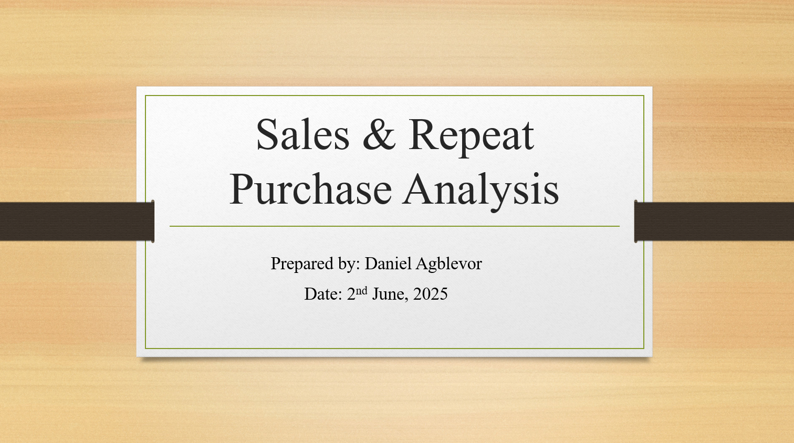

# Sales Data Analysis - Agriculture

A comprehensive analysis of agricultural sales data to uncover trends, product performance, and seasonal variations—empowering stakeholders to make informed, data-driven decisions.

---

## Table of Contents

- [Project Overview](#project-overview)
- [Data Description](#data-description)
- [Features](#features)
- [Visualizations](#visualizations)
- [Power BI Dashboard](#power-bi-dashboard)
- [Presentation Slides](#presentation-slides)
- [Project Structure](#project-structure)
- [Installation](#installation)
- [Usage](#usage)
- [Contributing](#contributing)
- [Tools](#tools)
- [Acknowledgments](#acknowledgments)
- [License](#license)

---

## Project Overview

This project analyzes agricultural sales data to provide actionable insights for business and policy stakeholders. The analysis focuses on identifying sales trends, evaluating product and category performance, and understanding seasonal patterns. All analysis is supported by data visualization and statistical exploration in Python and Power BI.

---

## Data Description

**Structure:**  
The dataset includes the following columns:

| Column    | Type    | Description                        |
|-----------|---------|------------------------------------|
| Date      | Date    | Date of sale (YYYY-MM-DD)          |
| Product   | String  | Name of the agricultural product   |
| Category  | String  | Product category (e.g., Grains)    |
| Sales     | Numeric | Sales amount (in local currency)   |
| Quantity  | Integer | Number of units sold               |

**Preprocessing Tasks:**  
- Handling of missing values and outliers.
- Standardized date formats.
- Aggregated sales by product, category, and time period.

---

## Features

- **Trend Analysis:** Identify trends in sales volume and revenue across time.
- **Product Performance:** Rank and visualize best-selling products and categories.
- **Seasonal Insights:** Detect fluctuations across weekdays and months.
- **Interactive Visualizations:** Use Power BI to explore sales interactively.
- **Modular Codebase:** Maintainable scripts and notebooks for flexible analysis.

---

## Visualizations

Below are sample visualizations generated by the analysis:

| Monthly Category Sales Trend | Monthly Product Sales Trend |
|-----------------------------|----------------------------|
|  |  |

| Sales by Day of the Week | Sales by Month |
|-------------------------|----------------|
|  |  |

| Sales by Product | Custom Metric Display |
|------------------|----------------------|
|  |  |

---

## Power BI Dashboard

The `.pbix` file includes interactive visuals built for stakeholder reporting. Key dashboard components include:

- Dynamic Filters for products, categories, and date ranges.
- KPI Cards showing total sales, units sold, and product share.
- Visual Slicers to explore temporal trends and category insights.


---

## Presentation Slides

The `.pptx` file summarizes findings and communicates key business insights to a non-technical audience. The presentation includes:

- Overview of analysis goals.
- Key findings and visual snapshots.
- Business implications and recommended actions.



---

## Project Structure

```plaintext
Sales-Data-Analysis_Agriculture/
├── assets/              # Charts, graphs, screenshots
│   ├── [*.png]          # Visual assets from .ipynb, .pbix, .pptx
├── data/                # Raw and processed CSV files
├── sales_analysis.ipynb
├── Sales_Report.pbix       # Power BI file
├── Executive_Summary.pptx    # Final presentation
├── requirements.txt     # Python dependency list
└── README.md            # Project documentation
```

---

## Installation

1. **Clone the Repository:**
    ```bash
    git clone https://github.com/daniel-agblevor/Sales-Data-Analysis_Agriculture.git
    cd Sales-Data-Analysis_Agriculture
    ```

2. **(Optional) Create a Virtual Environment:**
    ```bash
    python -m venv venv
    source venv/bin/activate  # On Windows use `venv\Scripts\activate`
    ```

3. **Install Dependencies:**
    ```bash
    pip install -r requirements.txt
    ```
    Or install main packages directly:
    ```bash
    pip install pandas matplotlib seaborn jupyter
    ```

---

## Usage

1. Place your sales dataset in the `data/` directory.
2. Open the Jupyter notebook interactively:
    ```bash
    jupyter notebook sales_analysis.ipynb
    ```
3. Explore the Power BI file:
    - Open `Sales_Report.pbix` with Power BI Desktop to explore the data interactively.
4. View the presentation:
    - Open `Executive_Summary.pptx` in any PowerPoint-compatible viewer.

---

## Contributing

Contributions are highly valued! To contribute:

1. Fork the repository.
2. Create your feature branch:
    ```bash
    git checkout -b feature/your-feature
    ```
3. Commit your changes:
    ```bash
    git commit -m "Add your message here"
    ```
4. Push to your fork:
    ```bash
    git push origin feature/your-feature
    ```
5. Submit a pull request.

---

## Tools

- **Python:** pandas, matplotlib, seaborn
- **Jupyter Notebook**
- **Power BI**
- **MS PowerPoint**
  
---

## Acknowledgments

- Data source: [Specify source if public]
- Libraries: pandas, matplotlib, seaborn, jupyter
- Contributors: [List contributors if any]

---

## License

This project is licensed under the MIT License. See the [LICENSE](LICENSE) file for details.
